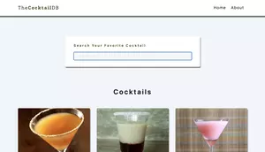

## Summary

Cocktail search with React router.

[Live Demo](https://christy313.github.io/react15-project15/)



## Note

1. [TheCocktailDB](https://www.thecocktaildb.com/)

2. Deployment router issue in Github pages

  - a. Install react-router-dom at least version 6

  - b. `import { HashRouter as Router, Routes, Route } from "react-router-dom";`

  - c. See below reference

    ```js
    const App = () => {
      return (
        <div>
          <Router>
            <Navbar />
            <Routes>
              <Route exact path="/" element={<Home />} />
              <Route path="/about" element={<About />} />
              <Route path="/cocktail/:id" element={<SingleCocktail />} />
              <Route path="/*" element={<Error />} />
            </Routes>
          </Router>
        </div>
      );
    };

    export default App;
    ```

3. React Router on Netlify issue

  - a. [Fix](https://dev.to/dance2die/page-not-found-on-netlify-with-react-router-58mc)

  - b. CRA Fix

    Modified below script in package.json file to fix the deploy issue in Netlify with React router.

    ```json
    "build": "CI= react-scripts build",
    ```
    
## File structure

```
.
└── src
    ├── App.js
    ├── components
    │   ├── Cocktail.js
    │   ├── CocktailList.js
    │   ├── Loading.js
    │   ├── Navbar.js
    │   └── SearchForm.js
    ├── context.js
    ├── index.css
    ├── index.js
    ├── logo.svg
    └── pages
        ├── About.js
        ├── Error.js
        ├── Home.js
        └── SingleCocktail.js
```

## Available Scripts

In the project directory, you can run:

### `npm start`

Runs the app in the development mode.\
Open [http://localhost:3000](http://localhost:3000) to view it in your browser.
